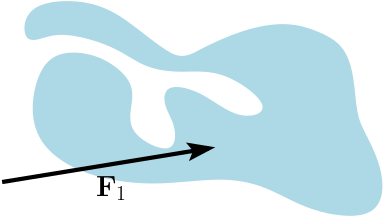

# Discussão :speech_balloon:

Nessa tarefa de laboratório é buscado do aluno o entendimento da classe `bool` do `python`. Essa categoria é oriunda da comparação feita entre duas variáveis. 

Imagine que nós estivéssemos estudando Mecãnica Vetorial e estivéssemos comparando a ação que duas forças tem em um corpo. 

<p align="center">
  
</p>

<p align="center">
  
</p>

Note que nas figuras acima, temos o mesmo corpo sendo sujeito a duas situações não simultâneas. Na primeira atua uma F<sub>1</sub> com a direção, sentido e magnitude mostrados. O mesmo se repete para F<sub>2</sub>. Caso quissésemos comparar ambas as forças teríamos que contabilizar esses três parâmetros que definem um vetor. Imagine que F<sub>1</sub> vale 30 newtons (30 N) e está inclinada 20 graus (20°) com a horizontal no sentido anti-horário, enquanto  F<sub>2</sub> vale 7,5 newtons (7 N) e está a 180°. Nesse caso poderíamos saber se elas se assemelham de alguma forma primeiramente analisando sua magnitude. Se tomarmos como base as respostas como verdadeiras e falsas, como será aprofundado em `python`, se dissermos que ambas as forças tem mesma magnitude chegamos de maneira intuitiva que a resposta é **falsa**. Entretanto, se mudarmos o enunciado e agora dissermos que a força F<sub>1</sub> é quatro vezes maior que F<sub>2</sub>, temos que a nova resposta será verdadeira já que 4 vezes 7,5 (4 * 7,5) é 30. Se analisamos a direção e o sentido temos que nos dois casos a resposta é falsa, pois enquanto F<sub>1</sub> está inclinada F<sub>2</sub> é horizontal. 

Após essa análise um pouco mais concreta, como poderíamos adequar o mesmo raciocínio para um algoritmos em `python`. Temos que resgatar a ideia dos tipos de uma variável e introduzir o conceito de variáveis booleanas. 

Temos as seguintes linhas de código

```python
>>> a = 30
>>> b = 20
>>> a == b
False
```

Foram declaradas as variáveis `a` e `b` e atribuídos os valores `30` e `20`, respectivamente. Contudo, diferente do que foi feito até agora, a linha `a == b` representa uma comparação entre `a` e `b`, como se fosse dito: *"a é igual a b?"*

O retorno dessa linha é verdadeiro ou falso (`True`/`False`). No caso visto `30` não é igual a `20`, logo a expressão booleana resulta em `False`. Mas se mudássemos para

```python
>>> a == a
True
```

De fato é o resultado esperado já que `30` é igual a `30`. 

Essa comparação se limita a números. Igual ao que foi visto na parte das operações com `ints`, `floats` e `strings` a comparação entre textos tambpem existe. Então, se fizermos

```python
>>> nome_1 = "Newton"
>>> nome_2 = "Einstein"
>>> nome_1 == nome_2
False
>>> nome_1 != nome_2
True
```

Após atribuir os valores de dois nomes às variáveis `nome_1` e `nome_2`, foi feita a comparação de maneira análoga ao que foi visto para `a` e `b`. Entreatanto, ao comparar o conteúdo de cada variável o valor retornado é `False` para o operador de igualdade (`==`).

(Obs: **É importante ressaltar a diferença existente entre os símbolos `=` e `==`.** O primeiro caso - um sinal de igual - é usado para as atribuições vistas até aqui, logo ao utilizá-lo está sendo dito para uma determinada variável armazenar/receber o valor do lado direito da igualdade. Para o segundo caso deve ser considerado a igualdade de forma análoga à comparação matemática, sendo assim o lado esquerdo deve ser igual ao lado direito, sendo que os dois precisam ter sido declarados para que não haja erros na execução). Para melhorar o entendimento serão dados alguns exemplos. 

```python
with_cough = input()
with_fever = input()
difficulty_breathing = input()
with_covid = "True"

def verify(a, b, c):
  if a == "True" and b == "True" and c == "True":
    return with_covid
  else:
    return with_covid == "False"

print('Tosse:', with_cough == "True")
print('Febre:', with_fever == "True")
print('Dificuldade para respirar:', difficulty_breathing == "True")
print('Provavelmente eh COVID-19:', verify(with_cough, with_fever, difficulty_breathing)) 
```


```python
with_cough = input()
with_fever = input()
difficulty_breathing = input()
with_covid = "True"

verify = with_cough == "True" and with_fever == "True" and difficulty_breathing == "True" 

print('Tosse:', with_cough == "True")
print('Febre:', with_fever == "True")
print('Dificuldade para respirar:', difficulty_breathing == "True")
print('Provavelmente eh COVID-19:', verify) 
```